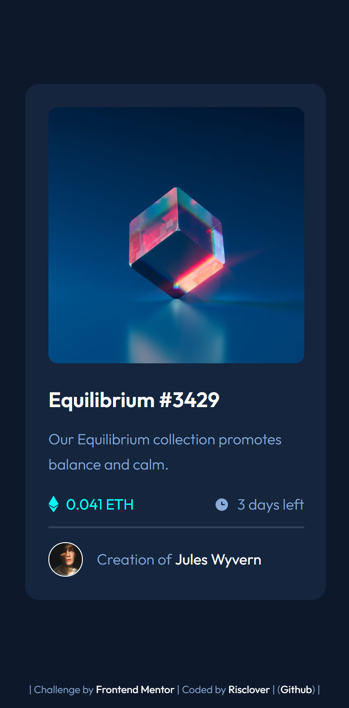
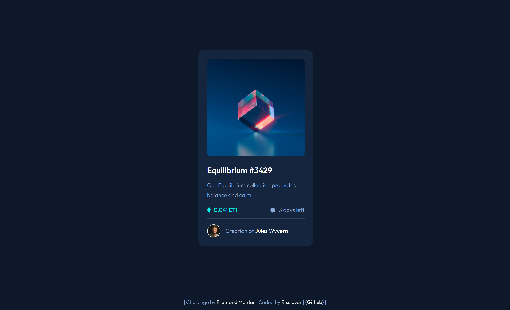

# Frontend Mentor - NFT preview card component solution

This is a solution to the [NFT preview card component challenge on Frontend Mentor](https://www.frontendmentor.io/challenges/nft-preview-card-component-SbdUL_w0U). Frontend Mentor challenges help you improve your coding skills by building realistic projects. 

## Table of contents

- [Overview](#overview)
  - [The challenge](#the-challenge)
  - [Screenshots](#screenshot)
    - [Mobile view](#mobile-view)
    - [Desktop view](#desktop-view)
  - [Links](#links)
- [My process](#my-process)
  - [Built with](#built-with)
  - [What I learned](#what-i-learned)
  - [Continued development](#continued-development)
- [Author](#author)

**Note: Delete this note and update the table of contents based on what sections you keep.**

## Overview

### The challenge

Users should be able to:

- View the optimal layout depending on their device's screen size
- See hover states for interactive elements

### Screenshot

#### Mobile View

#### Desktop View

### Links

- [View solution](https://www.frontendmentor.io/profile/Risclover)
- [Go to live site](https://risclover.github.io/NFT-Preview-Card-Component)

## My process

### Built with

- Semantic HTML5 markup
- Flexbox
- Mobile-first workflow

### What I learned

To be honest, nothing. I did, however, want to mention that I was able to complete this in no more than a half hour. I'm so proud of myself for getting this HTML/CSS stuff down!

Oh, I did, however, manage to do the hero image hover effect pretty much by myself. I'm proud of that.

### Continued development

I'm going to continue to focus on JavaScript, but I will be completing these Frontend Mentor challenges from time to time to continue to practice HTML and CSS.

## Author

- Frontend Mentor - [@Risclover](https://www.frontendmentor.io/profile/Risclover)
- Github - [Risclover](https://www.github.com/Risclover)
